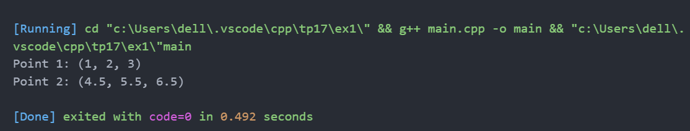
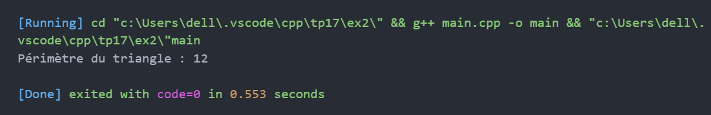
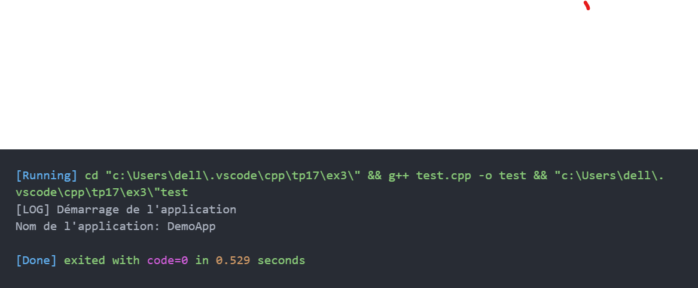
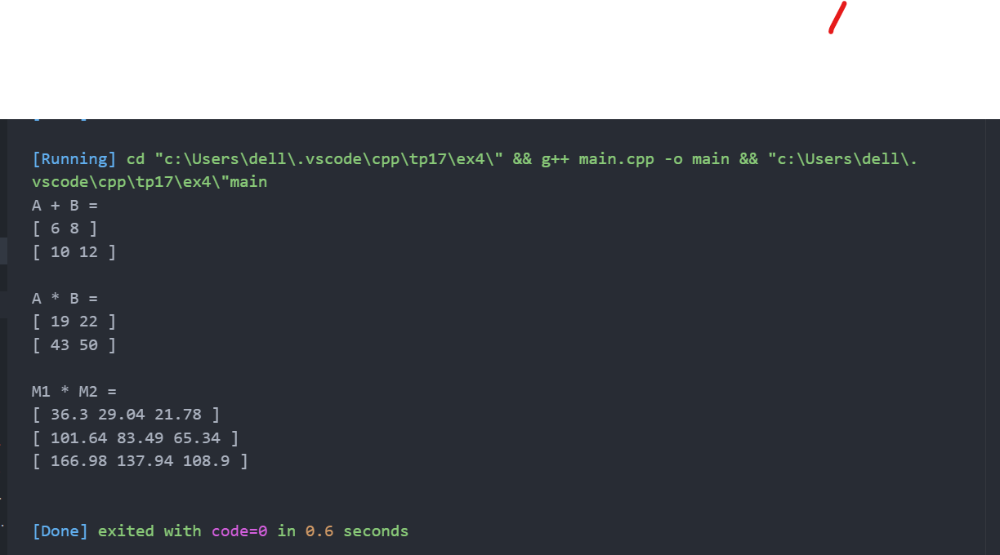

# TP17 : Organisation modulaire

## Exercice 1 — Séparation header/source  
Séparer la classe Point3D en fichiers `.h` et `.cpp`.  
Création d’un programme qui affiche deux points.

---

## Exercice 2 — Mini-bibliothèque géométrique  
Organisation modulaire de classes Point, Segment, Triangle dans `/include` et `/src`.  
Calcul du périmètre d’un triangle.

---

## Exercice 3 — Librairie statique (.a) et partagée (.so)  
Création des classes Logger (singleton) et Config dans une librairie réutilisable.  
Programme test utilisant la librairie.

---

## Exercice 4 — Classe template dans header uniquement  
Classe template Matrix<T, N, M> définie uniquement dans un fichier header.  
Exemples avec matrices d’entiers et de doubles.

